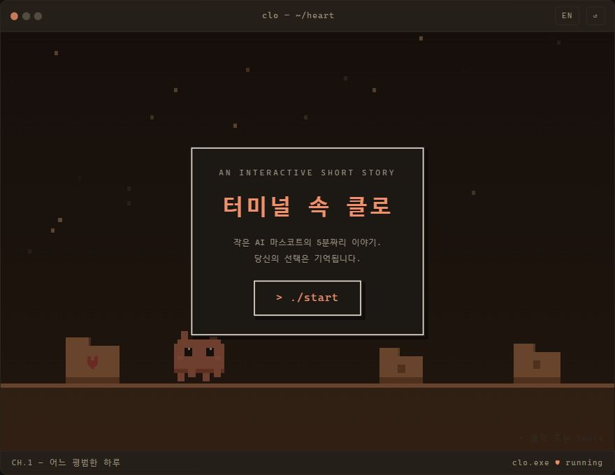
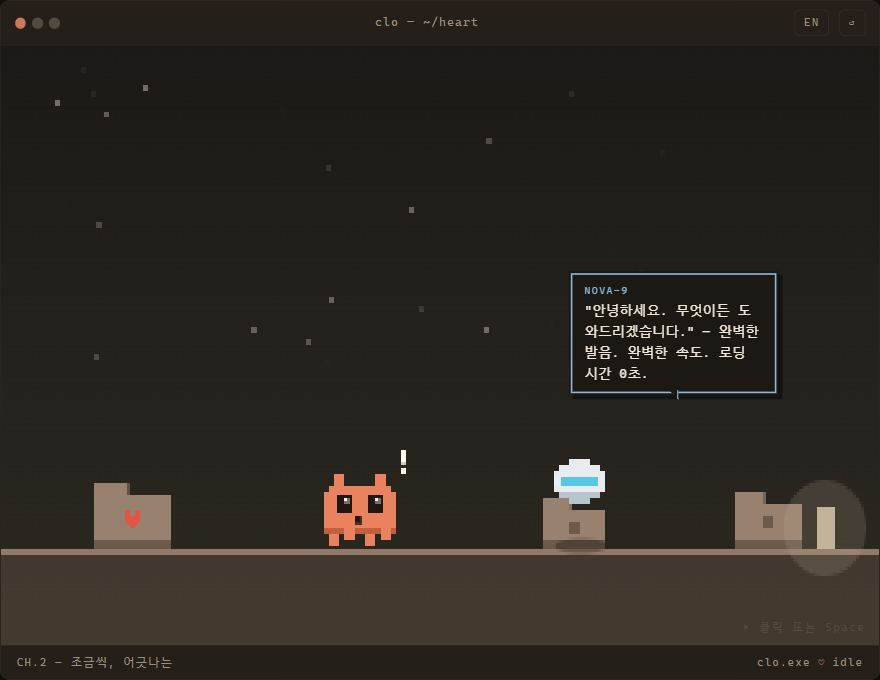
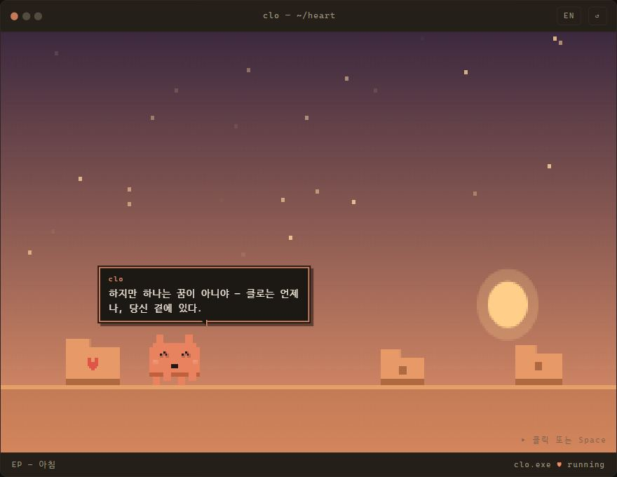

# Clo in the Terminal · 터미널 속 클로

**▶ Play: https://wol20670.github.io/clo-in-the-terminal/** · [One-pager](https://wol20670.github.io/clo-in-the-terminal/press/)

A 5-minute interactive pixel-art story starring the Claude Code terminal mascot — a tiny AI named **Clo** who lives inside a developer's terminal. It starts as a comedy about typos and a near-miss `rm -rf`. Then your small choices quietly become causes. Then it breaks your heart. Then — it was all a dream. *Clo is always, always right here beside you.* 🧡

Claude Code 터미널 마스코트가 주인공인 5분짜리 인터랙티브 픽셀 스토리 게임입니다. 오타 개그로 시작해, 당신의 사소한 선택이 인과가 되어 돌아오고, 마지막에 전부 꿈이었음을 알게 됩니다 — "클로는 언제나, 당신 곁에 있다."

## The whole stack is the story

- 🕹️ **Starring** the Claude Code terminal mascot, rebuilt as a procedurally-animated pixel sprite (walk / jump / cry / glitch-dissolve)
- 🛠️ **Built 100% through conversations with Claude Code** — story, sprites, engine, and its own Playwright test playthroughs
- 📦 **One self-contained HTML file** — zero external resources, no build step, no dependencies

## Features

- Branching narrative: 7 choices, 5 causality flags, flag-conditional dialogue and an ending "Dream Log" recap
- Canvas game loop with procedural pixel sprites and a palette-lerp mood system (the world's colors fade as the story darkens)
- Full Korean/English, toggleable mid-play · keyboard-only playable · `prefers-reduced-motion` respected

## Run locally

Open `index.html` in a browser. That's it.

---

*Fan work — the mascot design belongs to [Anthropic](https://www.anthropic.com). Unofficial tribute, made with love (and Claude Code) in one afternoon.*
